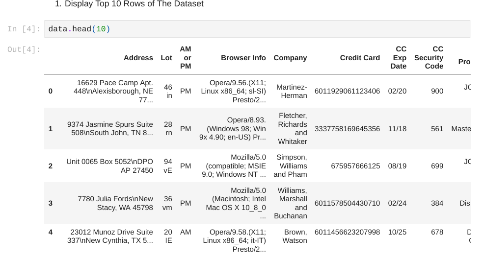
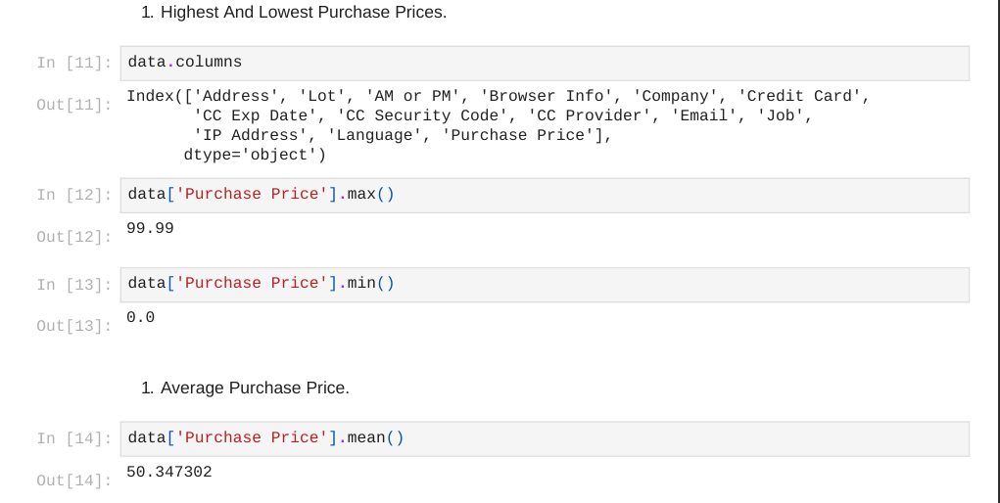
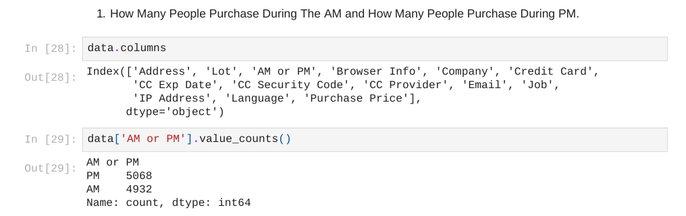

# 🛒 Ecommerce Purchases – Exploratory Data Analysis (EDA)


---

## 📌 Project Overview
This project performs **Exploratory Data Analysis (EDA)** on an e-commerce purchases dataset to uncover:

- Customer purchase behavior
- Payment trends
- Time-based buying patterns
- Email domain popularity
- Credit card usage insights

The goal is to simulate a **real-world business analytics scenario** using Python and Pandas.

---

## 🎯 Business Questions Solved

✔ What is the average purchase price?  
✔ Which payment providers are most used?  
✔ Do customers purchase more in AM or PM?  
✔ Which email providers dominate the customer base?  
✔ How many technical professionals (Engineers) are customers?  

---

## 📊 Dataset Information

| Feature | Details |
|---|---|
| Rows | 10,000 |
| Columns | 14 |
| Missing Values | None |
| Memory Usage | ~1.1 MB |

### 🧾 Columns Included
- Address
- Lot
- AM or PM
- Browser Info
- Company
- Credit Card
- CC Exp Date
- CC Security Code
- CC Provider
- Email
- Job
- IP Address
- Language
- Purchase Price

---

## 🧰 Tech Stack

- 🐍 Python  
- 🐼 Pandas  
- 📓 Jupyter Notebook  

---

## 🔍 Key Analysis Performed

### 📈 Statistical Analysis
- Highest Purchase Price → **$99.99**
- Lowest Purchase Price → **$0.00**
- Average Purchase Price → **$50.35**

---

### 🌍 Customer Language Insights
- French Language Users → **1097 Customers**

---

### 💳 Payment Insights
- Mastercard Purchases > $50 → **405 Customers**
- Credit Cards Expiring in 2020 → **988 Customers**

---

### ⏰ Time-Based Purchase Behavior

| Time | Purchases |
|---|---|
| AM | 4932 |
| PM | 5068 |

➡ Slightly higher purchase activity during **PM**

---

### 📧 Email Provider Popularity

Top Email Domains:

1. hotmail.com  
2. yahoo.com  
3. gmail.com  
4. smith.com  
5. williams.com  

---

## 🎥 Project Visual Walkthrough

### 📊 Dataset Head Preview


---

### 💰 Purchase Price Distribution


---

### ⏰ AM vs PM Purchase Comparison


---

## 🖼 What These Visuals Show

📌 **Dataset Head Output**  
Shows raw dataset structure, column types, and sample data rows.

📌 **Purchase Price Distribution**  
Helps understand:
- Customer spending behavior  
- Price concentration range  
- Outlier purchases  

📌 **AM vs PM Chart**  
Helps business teams:
- Schedule marketing campaigns  
- Optimize push notification timing  
- Plan flash sales timing  

---

## 📊 How This Helps Business Teams

### 💰 Revenue Team
- Identify average customer spend  
- Detect high-value customer segments  

### 📢 Marketing Team
- Target email campaigns based on domain usage  
- Optimize campaign timing using AM/PM trend  

### 🔐 Risk Team
- Monitor credit card usage patterns  
- Detect suspicious transaction signals  

---

## ⚡ Advanced Pandas Skills Demonstrated

- Boolean Filtering  
- String Feature Extraction  
- Lambda Functions  
- Value Counts Analysis  
- Multi-condition Filtering  

---

## 🧠 Real-World Data Analyst Skills Demonstrated

✔ Data Exploration  
✔ Business Insight Extraction  
✔ Customer Behavior Analysis  
✔ Transaction Pattern Analysis  
✔ Feature Level Investigation  

---

## 🧪 Sample Analysis Tasks

✔ Find customers using specific IP address  
✔ Detect job titles containing "Engineer"  
✔ Extract email domains using string operations  
✔ Filter high-value purchases by payment provider  

---
📁 Ecommerce-Purchases-EDA
├ 📄 Ecommerce Purchases Dataset.csv
├ 📓 EDA Notebook.ipynb
├ 🖼 head.png
├ 🖼 price destribution.png
├ 🖼 ampm.png
├ 🖼 store.png
└ 📄 README.md


---

## 🔮 Future Enhancements

🚀 Power BI Dashboard Version  
🚀 Streamlit Web App Version  
🚀 Customer Segmentation ML Model  
🚀 Purchase Price Prediction Model  
🚀 Time Based Purchase Trend Forecasting  

---

## 👨‍💻 Author

**Asad Malik**  
📊 Data Analyst | Python | SQL | Power BI | Excel  

🎓 Bachelor’s in Computer Application  
📍 India  

🔗 GitHub: https://github.com/Malikasad74  

---

## ⭐ Support

If you like this project:

⭐ Star the repo  
🍴 Fork the repo  
📢 Share with others  

---

## 🚀 How to Run

```bash
# Clone repository
git clone https://github.com/Malikasad74/ecommerce-eda.git

# Install dependencies
pip install pandas

# Run notebook
jupyter notebook

## 📂 Project Structure

